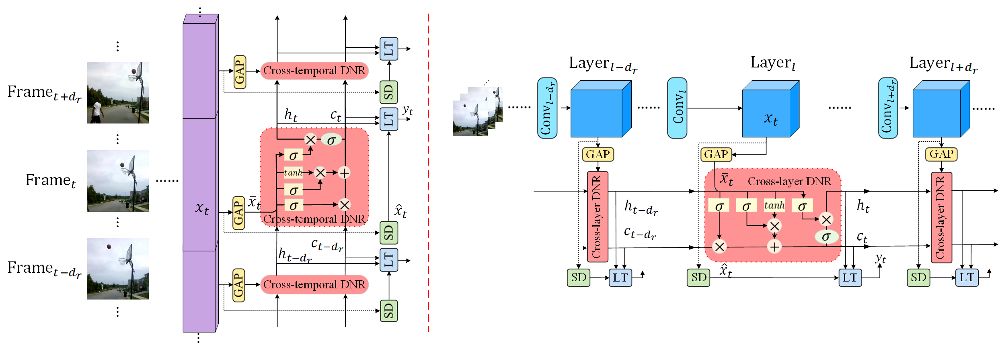

# Dynamic Normalization and Relay for Video Action Recognition
By Dongqi Cai, Anbang Yao, Yurong Chen.

This is the pytorch implementation of our paper ["Dynamic Normalization and Relay for Video Action Recognition"](https://proceedings.neurips.cc/paper/2021/file/5bd529d5b07b647a8863cf71e98d651a-Paper.pdf), published in NeurIPS 2021.

## Overview
<p align="center"></p>

## Usage

This implementation is based upon [mmaction](https://github.com/open-mmlab/mmaction.git) which is simpler than [mmaction2](). And the core functions (cross-temporal and cross-layer dynamic normalization and relay) can also be esily ported to mmaction2. 
* Install [mmaction](https://github.com/open-mmlab/mmaction.git) following [installing instructions](https://github.com/open-mmlab/mmaction/blob/master/INSTALL.md).
* Prepare dataset [Kinetics-400](https://github.com/open-mmlab/mmaction/blob/master/data_tools/kinetics400/PREPARING_KINETICS400.md).
* Put model files "resnet_dnr.py" into folder ["mmaction/mmaction/models/tenons/backbones/"](https://github.com/open-mmlab/mmaction/tree/master/mmaction/models/tenons/backbones) and register the models in ["\_\_init\_\_.py"](https://github.com/open-mmlab/mmaction/blob/master/mmaction/models/tenons/backbones/__init__.py).
* Folder "configs" contains config files for training and evaluating ResNet50-DNR on Kinetics-400. Put it into ["configs"](https://github.com/open-mmlab/mmaction/tree/master/configs).
* Run Training and Testing scripts under mmaction root folder as below.

## Training
```
./tools/dist_train_recognizer.sh configs/DNR_resnet50_kinetics400_rgb_seg1_f8s8.py 8 --validate
```

## Testing
```
./tools/dist_test_recognizer.sh configs/DNR_resnet50_kinetics400_rgb_seg1_f8s8.py work_dirs/DNR_r50_kinetics400_rgb_seg1_8x8_scratch/epoch_196.pth 8 --out DNR_r50_kinetics_results.pkl
```

## Citation

If you find our code useful for your research, please consider citing:

    @inproceedings{cai2021dynamic,
        title={Dynamic Normalization and Relay for Video Action Recognition},
        author={Cai, Dongqi and Yao, Anbang and Chen, Yurong},
        journal={Advances in Neural Information Processing Systems},
        volume={34},
        year={2021}
    }


## License

DNR is released under MIT License.
